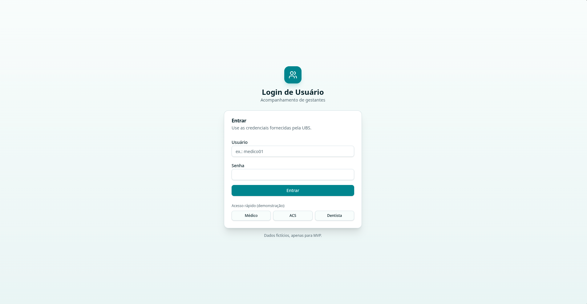
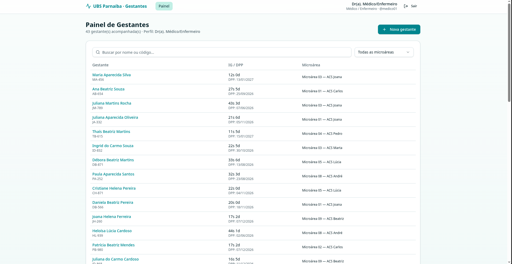
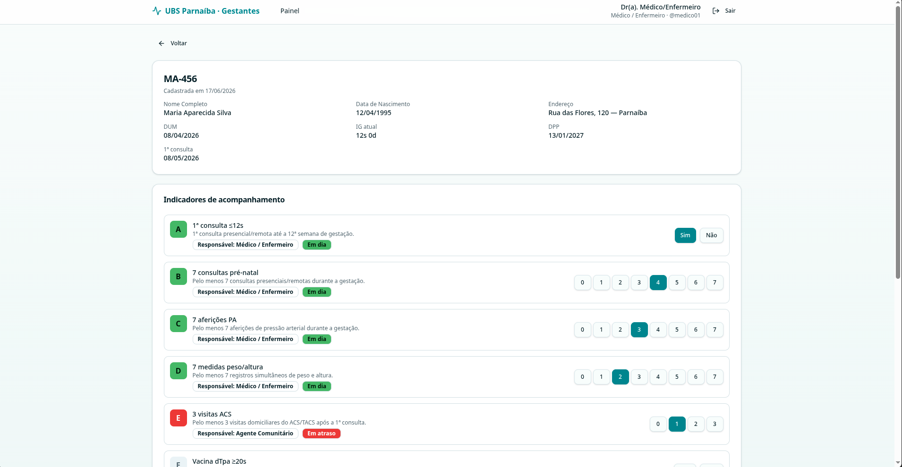
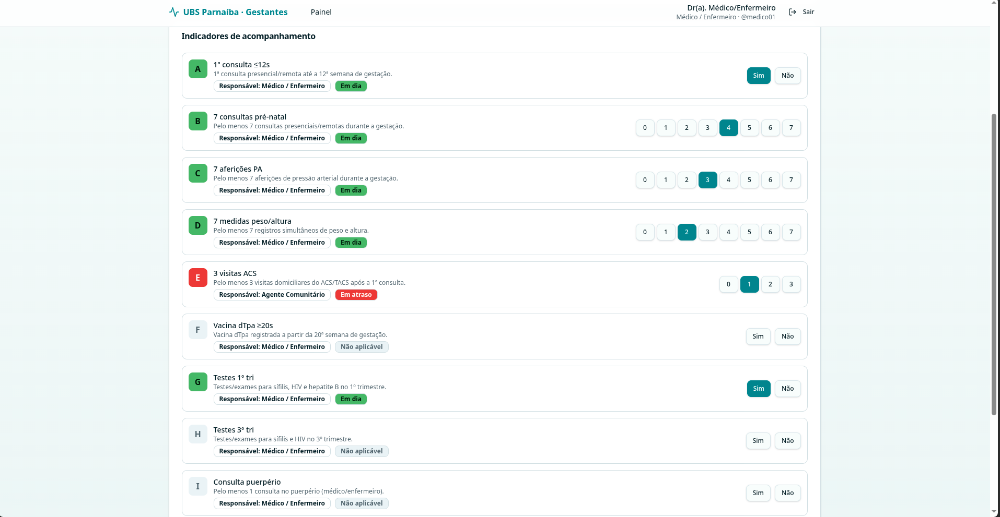
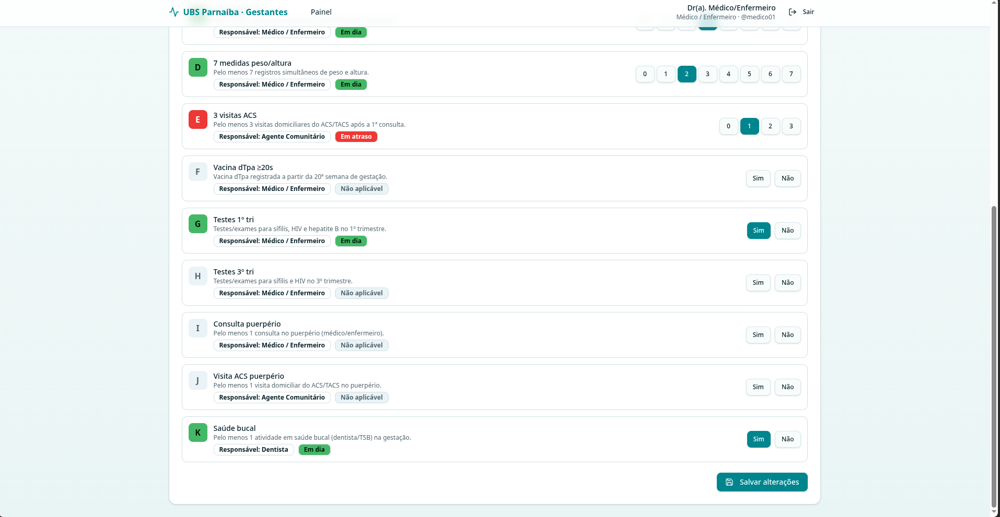

# Guia de Uso — Acompanhamento de Gestantes (UBS Parnaíba)

Este guia explica, tela a tela, como usar o sistema de acompanhamento de gestantes.
Cada seção descreve o que é cada componente visível e como interagir com ele.

> **Observação:** este é um protótipo (MVP). Os dados são fictícios e ficam salvos
> apenas no navegador do próprio dispositivo.

---

## Sumário

1. [Perfis de acesso](#1-perfis-de-acesso)
2. [Tela de Login](#2-tela-de-login)
3. [Painel de Gestantes](#3-painel-de-gestantes)
4. [Página da Gestante](#4-página-da-gestante)
5. [Indicadores de acompanhamento](#5-indicadores-de-acompanhamento)
6. [Salvar alterações e sair com segurança](#6-salvar-alterações-e-sair-com-segurança)

---

## 1. Perfis de acesso

O sistema tem **três perfis**, e cada um enxerga apenas o que é pertinente ao seu
contexto de trabalho:

| Perfil | Usuário | Senha | O que enxerga |
| --- | --- | --- | --- |
| **Médico / Enfermeiro** | `medico01` | `medico_senha` | Todos os dados clínicos e **todos** os indicadores (A a K) |
| **Agente Comunitário (ACS)** | `acs` | `acs_senha` | Apenas informações de campo e os indicadores **E** e **J** |
| **Dentista** | `dentista01` | `dentista_senha` | Resumo clínico e o indicador **K** (saúde bucal) |

Cada perfil só pode **editar** os indicadores sob sua responsabilidade. Os demais
aparecem como **somente leitura** (com um cadeado 🔒).

---

## 2. Tela de Login

É por aqui que você entra no sistema.

- **Usuário** — digite o login fornecido pela UBS (ex.: `medico01`).
- **Senha** — digite a senha correspondente.
- **Entrar** — botão que valida as credenciais e leva ao Painel de Gestantes.
- **Acesso rápido (demonstração)** — os botões **Médico**, **ACS** e **Dentista**
  preenchem e entram automaticamente com um usuário de cada perfil. Servem apenas
  para demonstração do protótipo.

Se o usuário ou a senha estiverem incorretos, uma mensagem de erro é exibida.

---

## 3. Painel de Gestantes

Tela inicial após o login. Lista todas as gestantes em acompanhamento.

### Cabeçalho (topo, presente em todas as telas)

- **UBS Parnaíba · Gestantes** — logotipo; ao clicar, volta ao Painel.
- **Painel** — atalho de navegação para esta mesma tela.
- **Identificação do usuário** (canto direito) — nome, perfil e login de quem
  está conectado.
- **Sair** — encerra a sessão e volta para a tela de Login.

### Corpo da tela

- **Título e contagem** — "Painel de Gestantes" com o total acompanhado e o perfil
  atual (ex.: *"43 gestante(s) acompanhada(s) · Perfil: Dr(a). Médico/Enfermeiro"*).
- **+ Nova gestante** — abre o formulário de cadastro de uma nova gestante.
- **Buscar por nome ou código** — filtra a lista conforme você digita (por nome ou
  pelo código da gestante, ex.: `MA-456`).
- **Todas as microáreas** — filtro suspenso para exibir apenas gestantes de uma
  microárea específica.

### Tabela de gestantes

Cada linha é **clicável** e abre a página detalhada da gestante. As colunas são:

| Coluna | Significado |
| --- | --- |
| **Gestante** | Nome completo e, abaixo, o código identificador (ex.: `MA-456`) |
| **IG / DPP** | Idade Gestacional atual (semanas + dias) e a Data Provável do Parto |
| **Microárea** | Microárea e o ACS responsável por aquela gestante |

---

## 4. Página da Gestante

Abre ao clicar em uma gestante no painel. Reúne os dados cadastrais e os
indicadores de acompanhamento.

- **← Voltar** — retorna ao Painel de Gestantes.

### Cartão de identificação

Exibe o **código** da gestante (ex.: `MA-456`), a data de cadastro e o resumo de
dados. O que aparece aqui **depende do perfil**:

- **Médico/Enfermeiro e Dentista** veem o resumo clínico: Nome Completo, Data de
  Nascimento, Endereço, DUM (Data da Última Menstruação), IG atual, DPP (Data
  Provável do Parto) e data da 1ª consulta.
- **ACS**, por privacidade, vê apenas a DPP.

### Cartão "Indicadores de acompanhamento"

Logo abaixo, lista os indicadores de saúde da gestante. É explicado em detalhe na
próxima seção.

---

## 5. Indicadores de acompanhamento

Cada indicador é uma linha com estes elementos:

- **Letra colorida** (à esquerda) — identifica o indicador (A a K). A **cor** reflete
  o status atual (ver legenda abaixo).
- **Título e descrição** — nome curto (ex.: *"7 consultas pré-natal"*) e a regra
  completa do indicador.
- **Responsável** — de qual perfil é a responsabilidade pelo preenchimento.
- **Status** — etiqueta que resume a situação (ex.: *Em dia*, *Em atraso*).
- **Controle de preenchimento** (à direita) — como você registra o valor:
  - **Sim / Não** — para indicadores de confirmação (ex.: vacina aplicada?).
  - **Números (0 a 7 ou 0 a 3)** — para indicadores de contagem (ex.: nº de
    consultas). Clique no número correspondente ao total já realizado.

Se o indicador **não for da sua responsabilidade**, ele aparece como
**somente leitura** (com cadeado 🔒) — você o vê, mas não pode alterá-lo.

### Legenda de status

| Cor | Status (contagem) | Status (Sim/Não) | Significado |
| --- | --- | --- | --- |
| 🟢 Verde | Em dia | Em dia | Meta atingida / dentro do prazo esperado para a IG |
| 🟡 Amarelo | Levemente atrasado | Próximo do vencimento | Um pouco abaixo do esperado — atenção |
| 🔴 Vermelho | Em atraso | Vencido | Fora do prazo / meta não atingida |
| ⚪ Cinza | Não aplicável | Não aplicável | Ainda não faz sentido cobrar nesta fase da gestação |

O status é **calculado automaticamente** combinando o valor registrado com a
Idade Gestacional (e, quando for o caso, se já houve parto).

### Lista completa de indicadores

| # | Indicador | O que registra | Responsável | Controle |
| --- | --- | --- | --- | --- |
| **A** | 1ª consulta ≤12s | 1ª consulta (presencial/remota) até a 12ª semana | Médico/Enfermeiro | Sim/Não |
| **B** | 7 consultas pré-natal | Pelo menos 7 consultas durante a gestação | Médico/Enfermeiro | 0–7 |
| **C** | 7 aferições PA | Pelo menos 7 aferições de pressão arterial | Médico/Enfermeiro | 0–7 |
| **D** | 7 medidas peso/altura | Pelo menos 7 registros de peso e altura | Médico/Enfermeiro | 0–7 |
| **E** | 3 visitas ACS | Pelo menos 3 visitas domiciliares do ACS/TACS após a 1ª consulta | Agente Comunitário | 0–3 |
| **F** | Vacina dTpa ≥20s | Vacina dTpa registrada a partir da 20ª semana | Médico/Enfermeiro | Sim/Não |
| **G** | Testes 1º tri | Testes de sífilis, HIV e hepatite B no 1º trimestre | Médico/Enfermeiro | Sim/Não |
| **H** | Testes 3º tri | Testes de sífilis e HIV no 3º trimestre | Médico/Enfermeiro | Sim/Não |
| **I** | Consulta puerpério | Pelo menos 1 consulta no puerpério | Médico/Enfermeiro | Sim/Não |
| **J** | Visita ACS puerpério | Pelo menos 1 visita domiciliar do ACS/TACS no puerpério | Agente Comunitário | Sim/Não |
| **K** | Saúde bucal | Pelo menos 1 atividade em saúde bucal (dentista/TSB) | Dentista | Sim/Não |

---

## 6. Salvar alterações e sair com segurança

No rodapé do cartão de indicadores fica o botão **Salvar alterações**.

- Enquanto você não fizer nenhuma mudança, o botão fica **desabilitado** (o cursor
  vira o símbolo de bloqueado ⊘).
- Ao alterar qualquer indicador, o botão é **habilitado**. Suas mudanças ficam
  **pendentes** — só são gravadas de fato quando você clica em **Salvar alterações**.

### Aviso de alterações não salvas

Se você tiver alterações pendentes e tentar **sair da página** por qualquer caminho
— botão **Voltar**, links do topo, botão **Sair** ou até o botão *voltar* do
navegador — o sistema exibe um aviso:

> **ALTERAÇÕES NÃO FORAM SALVAS, deseja salvar e continuar?**

- **Sim** — salva as alterações e sai da página.
- **Não** — sai **sem** salvar (as mudanças pendentes são descartadas).
- **Fechar o aviso** (clicar fora / tecla Esc) — permanece na página, sem sair.

> Ao **fechar ou recarregar a aba** do navegador com alterações pendentes, o próprio
> navegador exibe um aviso nativo de confirmação (nesse caso o texto é padrão do
> navegador e não é possível salvar automaticamente).
